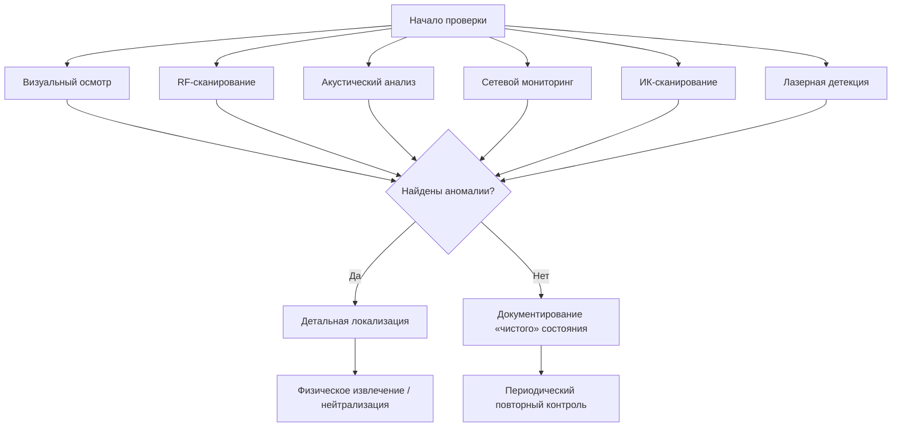

sudo setcap cap_net_admin,cap_net_raw+ep $(find /usr /opt -type f \( -name "hiddify-core" -o -name "sing-box" \) 2>/dev/null | head -n 1)
# 📋 Комплексное руководство по обнаружению скрытых устройств прослушки
**Версия:** 2.0 | **Дата обновления:** 2026 | **Статус:** Рабочий документ  
**Целевая аудитория:** Специалисты по безопасности, исследователи, технические энтузиасты

---

## 📑 Оглавление

1. [Введение](#1-введение)
2. [Классификация устройств прослушки](#2-классификация-устройств-прослушки)
3. [Методы обнаружения: обзор](#3-методы-обнаружения-обзор)
4. [Необходимое оборудование и ПО](#4-необходимое-оборудование-и-по)
5. [Метод 1: Визуальный и физический осмотр](#5-метод-1-визуальный-и-физический-осмотр)
6. [Метод 2: Радиочастотное детектирование (RF)](#6-метод-2-радиочастотное-детектирование-rf)
7. [Метод 3: Акустический анализ](#7-метод-3-акустический-анализ)
8. [Метод 4: Обнаружение Wi-Fi устройств](#8-метод-4-обнаружение-wi-fi-устройств)
9. [Метод 5: Обнаружение Bluetooth-устройств](#9-метод-5-обнаружение-bluetooth-устройств)
10. [Метод 6: Обнаружение GSM-жучков](#10-метод-6-обнаружение-gsm-жучков)
11. [Метод 7: Лазерное прослушивание и защита](#11-метод-7-лазерное-прослушивание-и-защита)
12. [Метод 8: Инфракрасный сканер](#12-метод-8-инфракрасный-сканер)
13. [Метод 9: RFID-приёмник](#13-метод-9-rfid-приёмник)
14. [Интеллектуальный анализ: ИИ и машинное обучение](#14-интеллектуальный-анализ-ии-и-машинное-обучение)
15. [Чек-листы и процедуры](#15-чек-листы-и-процедуры)
16. [Интерпретация результатов](#16-интерпретация-результатов)
17. [Юридические аспекты](#17-юридические-аспекты)
18. [Возможные ошибки и способы их устранения](#18-возможные-ошибки-и-способы-их-устранения)
19. [Приложения](#19-приложения)

---

## 1. Введение

### 1.1. Назначение документа
Данный документ представляет собой комплексное техническое руководство по обнаружению скрытых устройств аудио- и радиоперехвата («прослушки») в жилых и офисных помещениях. Документ объединяет классические методы обнаружения с современными подходами на базе программно-определяемого радио (SDR), анализа аномалий спектра и искусственного интеллекта.

### 1.2. Что такое «прослушка»
**Прослушка** — устройство для записи, перехвата или передачи аудио-, радио- или цифровых сигналов без ведома пользователей помещения.

**Типичные цели установки:**
- Несанкционированный мониторинг переговоров
- Сбор конфиденциальной информации
- Контроль доступа и перемещений
- Промышленный шпионаж

### 1.3. Принципы работы руководства
✅ Все методы основаны на физических принципах распространения сигналов  
✅ Каждый этап верифицируем и документируем  
✅ Приоритет — законность и безопасность проводящего проверку  
✅ Результаты должны быть воспроизводимы  
✅ Документ сохраняет полноту исходной информации с добавлением технических и концептуальных пояснений

---

## 2. Классификация устройств прослушки

| Тип устройства | Принцип работы | Частотный диапазон | Признаки обнаружения |
|---------------|---------------|-------------------|---------------------|
| **Аналоговый радиомикрофон** | Передача аудио на фиксированной частоте | 50–70 МГц, 100–500 МГц | Пик в спектре, стабильная несущая |
| **GSM-жучок** | Передача через сотовую сеть | 850/900/1800/1900 МГц | Активность при звонке, импульсный сигнал |
| **Wi-Fi модуль** | Передача данных по 802.11 | 2.4 ГГц, 5 ГГц | Необычный MAC, аномальный трафик |
| **Bluetooth-трекер** | Короткодистанционная передача | 2.4 ГГц (FHSS) | Периодические beacon-пакеты |
| **Инфракрасный датчик** | Передача через ИК-канал | 850–950 нм (оптический) | Тепловое пятно, ИК-вспышки |
| **Проводной микрофон** | Запись на карту памяти / передача по кабелю | — | Физическое наличие, скрытая проводка |
| **Лазерный съём звука** | Вибрация оконного стекла → лазерный луч | Оптический диапазон | Требуется спецоборудование для детекции |
| **RFID-маркер** | Пассивная/активная идентификация | 125 кГц, 13.56 МГц, 868/900 МГц | Отклик на запрос считывателя |

⚠️ **Важно:** Современные устройства могут комбинировать несколько технологий (например, GSM + Wi-Fi резерв), использовать технологию скачкообразной перестройки частоты (FHSS) и работать в пассивном режиме.

---

## 3. Методы обнаружения: обзор



### Сводная таблица методов

| Метод | Что обнаруживает | Точность | Сложность | Время выполнения |
|-------|-----------------|----------|-----------|-----------------|
| **Визуальный осмотр** | Физические устройства, провода | Низкая–Средняя | ★☆☆ | 30–60 мин |
| **Радиодетектор** | Активные передатчики 50 МГц–6 ГГц | Высокая | ★★☆ | 20–40 мин |
| **Акустический анализ** | Скрытые микрофоны по акустической сигнатуре | Средняя | ★★★ | 15–30 мин + анализ |
| **Wi-Fi сканирование** | Устройства в беспроводной сети | Высокая | ★★☆ | 10–20 мин |
| **Bluetooth-сканирование** | BLE-трекеры, гарнитуры | Средняя | ★★☆ | 5–15 мин |
| **Сетевой анализ (Wireshark)** | Аномальный трафик, неизвестные устройства | Очень высокая | ★★★ | 30–90 мин |
| **ИК-сканирование** | Активные электронные компоненты, тепловые аномалии | Средняя | ★★☆ | 15–30 мин |
| **Лазерная детекция** | Лазерные излучатели для виброметрии | Высокая | ★★★ | 20–40 мин |
| **Анализ аномалий (AI/ML)** | Скрытые паттерны в спектре, поведении сети | Очень высокая | ★★★ | Зависит от объёма данных |

---

## 4. Необходимое оборудование и ПО

### 4.1. Аппаратное обеспечение

| Категория | Минимальная конфигурация | Рекомендованная конфигурация | Примечание |
|-----------|-------------------------|-----------------------------|------------|
| **Радиодетектор** | Самодельный на 2N2222A, 50–70 МГц | Профессиональный RF-сканер (ORION, BugHunter) или RTL-SDR Blog V3 | Самодельный подходит для первичного скрининга |
| **Аудиооборудование** | Конденсаторный микрофон + звуковая карта 48 кГц/16 бит | Shure SM7B + RME Babyface Pro + экранированные кабели | Важно: низкий собственный шум микрофона |
| **Wi-Fi/Bluetooth адаптер** | Встроенный в ноутбук | Alfa AWUS036ACH (поддержка monitor mode) | Требуется драйвер с поддержкой захвата пакетов |
| **Ноутбук/ПК** | 4 ГБ ОЗУ, 2-ядерный процессор | 16 ГБ ОЗУ, 4+ ядер, SSD | Для обработки спектров и работы с Wireshark |
| **Инфракрасный сканер** | Камера смартфона с удалённым ИК-фильтром | FLIR ONE, Seek Thermal, Vishay VT100 + ADS1115 | Для обнаружения активных электронных компонентов |
| **SDR-платформа** | — | HackRF One, RTL-SDR, USRP | Для анализа I/Q данных и спектральных аномалий |
| **Инструменты** | Фонарик, зеркало на телескопической ручке | Эндоскопическая камера, тепловизор | Для осмотра труднодоступных мест |

### 4.2. Программное обеспечение

```bash
# Для Linux (Ubuntu/Debian)
sudo apt update
sudo apt install wireshark aircrack-ng rtl-sdr sox ffmpeg python3-pip

# Python-библиотеки для анализа
pip3 install numpy scipy matplotlib pandas soundfile librosa scapy

# Для Windows (альтернативы)
# - Wireshark: https://www.wireshark.org/
# - Audacity: https://www.audacityteam.org/
# - RTL-SDR: https://www.rtl-sdr.com/
# - SDR#: https://airspy.com/download/
```

| ПО | Назначение | Платформа | Лицензия |
|----|-----------|-----------|----------|
| **Wireshark** | Анализ сетевого трафика | Win/Linux/macOS | GPL |
| **Aircrack-ng** | Мониторинг/анализ Wi-Fi | Linux (предпочтительно) | GPL |
| **Audacity** | Запись и базовый анализ аудио | Кроссплатформенно | GPL |
| **Python + SciPy** | Спектральный анализ, фильтрация | Кроссплатформенно | BSD |
| **SDR# / Gqrx** | Работа с RTL-SDR, визуализация спектра | Win / Linux | Бесплатно |
| **nmap / Fing** | Сканирование сети, обнаружение устройств | Кроссплатформенно | Разные |
| **GNU Radio** | Обработка сигналов, SDR-приложения | Linux/Win/macOS | GPL |
| **Prahan** | Продвинутый аудиоканализ | Кроссплатформенно | Проприетарное |

---

## 5. Метод 1: Визуальный и физический осмотр

### 5.1. Подготовка помещения
✅ Отключите все известные источники радиопомех (роутеры, микроволновки, беспроводные мыши)  
✅ Обеспечьте тишину для акустических тестов  
✅ Проводите осмотр при разном освещении (дневной свет + фонарик под углом)  
✅ Используйте зеркало для осмотра пространства за мебелью, в вентиляционных решётках

### 5.2. Чек-лист визуального поиска

| Зона осмотра | Что искать | Инструменты |
|-------------|-----------|------------|
| **Потолок** | Подозрительные отверстия, новые пятна, антенны в светильниках | Фонарик, зеркало, эндоскоп |
| **Стены** | Неестественные выступы, свежие следы штукатурки, розетки с лишними проводами | Фонарик, детектор проводки |
| **Пол/плинтусы** | Скрытые полости, провода под покрытием | Фонарик, тонкий зонд |
| **Мебель** | Полости в спинках, днищах, ножках; встроенные устройства | Зеркало, эндоскоп |
| **Электротехника** | Модифицированные розетки, удлинители, блоки питания | Визуально + мультиметр (проверка потребления) |
| **Вентиляция** | Устройства в воздуховодах, дополнительные решётки | Эндоскоп, фонарик |
| **Предметы интерьера** | Часы, рамки, сувениры с неестественным весом/тепловыделением | Тепловизор, взвешивание |

### 5.3. Документирование
📸 Сфотографируйте все подозрительные объекты (с масштабом)  
📝 Зафиксируйте координаты в помещении (например: «северная стена, 1.2 м от угла, высота 2.1 м»)  
🗂️ Создайте папку «Проверка_Дата» с подпапками: `/photos`, `/notes`, `/spectra`, `/logs`

---

## 6. Метод 2: Радиочастотное детектирование (RF)

### 6.1. Теоретические основы

**Физический принцип:** Любое передающее устройство излучает электромагнитные волны на определённой частоте. Задача детектора — зафиксировать аномальный сигнал на фоне естественного радиошума.

**Ключевые параметры:**
- **Чувствительность:** минимальная мощность сигнала, которую может зафиксировать детектор (измеряется в дБм)
- **Диапазон частот:** покрываемый спектр (например, 50 МГц – 6 ГГц)
- **Разрешение по частоте:** способность различать близкие частоты (зависит от полосы фильтра)
- **Направленность антенны:** всенаправленная (поиск) или направленная (локализация)

**Формула оценки мощности сигнала:**
```
P_received = P_transmit + G_tx + G_rx - L_path - L_misc

где:
  P_received — мощность на входе приёмника [дБм]
  P_transmit — мощность передатчика [дБм]
  G_tx, G_rx — усиление антенн передатчика и приёмника [дБи]
  L_path — потери в свободном пространстве [дБ]
  L_misc — дополнительные потери (стены, мебель) [дБ]
```

**Анализ аномалий через параметр Dt:**
```
Dt = Σ√(Ip² + Qp²)

где:
  Ip, Qp — действительная и мнимая части каждого I/Q-выборочного значения
```
Этот подход более чувствителен к изменениям в сигнальном состоянии, чем простое измерение энергии.

### 6.2. Сборка собственного радиодетектора

#### Вариант A: Простая схема на транзисторе 2N2222A

```
Схема подключения:

        +9V
          │
          ├───[10kΩ]───┬─── коллектор 2N2222A
          │            │
          │         [33pF]───► Выход (на осциллограф/аудиовход)
          │            │
          │            │
        [1kΩ]          │
          │            │
          ├───[10pF]───┴─── база 2N2222A
          │
        Антенна (1 м провод)
          │
         GND
```

**Компоненты:**

| Деталь | Номинал | Количество | Примечание |
|--------|---------|------------|------------|
| Транзистор | 2N2222A (или BC547) | 1 | NPN, малой мощности |
| Резистор | 1 кОм, 0.25 Вт | 1 | Ограничение тока базы |
| Резистор | 10 кОм, 0.25 Вт | 1 | Нагрузка коллектора |
| Конденсатор | 10 пФ, керамический | 1 | Входной фильтр |
| Конденсатор | 33 пФ, керамический | 1 | Выходной фильтр |
| Антенна | Медный провод 1 м | 1 | Можно свернуть в спираль для компактности |
| Питание | Батарея 9V «Крона» | 1 | + разъём |

**Пошаговая сборка:**
1. Подготовьте макетную плату или печатную плату размером ~5×5 см
2. Припаяйте транзистор, соблюдая цоколёвку (эмиттер → GND)
3. Подключите резисторы и конденсаторы согласно схеме
4. Припаяйте антенну к точке соединения 10pF и базы транзистора
5. Подключите питание: +9V → 10kΩ → коллектор; GND → эмиттер
6. Выходной сигнал снимайте с коллектора через 33pF

🔧 **Калибровка:** Подключите выход к осциллографу или аудиовходу ПК. Поднесите источник сигнала (например, рацию на 60 МГц) и подстройте ёмкость 10pF (можно использовать подстроечный конденсатор 5–30pF) для максимизации отклика.

#### Вариант B: Продвинутая схема на RTL-SDR (рекомендуется)

```bash
# Оборудование: RTL-SDR Blog V3 (~$25) + антенна

# Установка драйверов (Linux)
sudo apt install rtl-sdr librtlsdr-dev

# Проверка устройства
rtl_test -t

# Запуск сканирования в реальном времени
rtl_power -f 50M:6G:1M -i 1m -1 -g 40 -p 0 scan.csv

# Визуализация (требует gnuplot)
rtl_power -f 400M:410M:1k -i 10 -1 -g 40 | tee scan.log | \
  gnuplot -p -e "set terminal dumb; plot 'scan.log' using 1:6 with lines"
```

**Преимущества RTL-SDR:**
- Диапазон: 24 МГц – 1.76 ГГц (с модификациями — до 6 ГГц)
- Разрешение: до 1 Гц (программно настраиваемое)
- Запись полного спектра для последующего анализа
- Интеграция с GNU Radio, Python, MATLAB

### 6.3. Процедура сканирования

📋 **Алгоритм работы с радиодетектором:**

```
1. Калибровка в «чистом» месте
   └─ Выйдите на открытое пространство (балкон, двор)
   └─ Зафиксируйте уровень фонового шума в целевом диапазоне

2. Сканирование помещения по периметру
   └─ Двигайтесь медленно (~10 см/сек) вдоль стен
   └─ Держите антенну вертикально для поляризации большинства передатчиков
   └─ Записывайте показания каждые 30 см или при изменении уровня >3 дБ

3. Локализация источника
   └─ При обнаружении пика: уменьшите чувствительность (gain)
   └─ Используйте направленную антенну (если есть) или метод «триангуляции»
   └─ Отмечайте точку максимума сигнала

4. Верификация
   └─ Временно отключите все известные источники (роутер, телефон)
   └─ Повторите сканирование: если пик остался — вероятная прослушка
   └─ Попробуйте модулировать сигнал (постучите рядом с предполагаемым устройством): 
      если в спектре появляется модуляция — это аудио-передатчик
```

**Интерпретация спектра:**

✅ **Нормальный фон:** плавный «шумовой пол», пики только на известных частотах (ТВ, радио, сотовые вышки)

⚠️ **Тревожные признаки:**
- Узкий стабильный пик вне стандартных диапазонов
- Пик с амплитудной модуляцией (слышен голос/шум при демодуляции)
- Импульсный сигнал с периодом 1–60 сек (признак GSM-жучка в режиме ожидания)
- Сигнал, исчезающий при приближении руки (экранирование)

---

## 7. Метод 3: Акустический анализ

### 7.1. Физическое обоснование

**Принцип суперпозиции звуковых волн:**
```
p(t) = Σ Aᵢ·sin(ωᵢ·t + φᵢ)

где:
  p(t) — звуковое давление в точке записи
  Aᵢ, ωᵢ, φᵢ — амплитуда, частота и фаза i-го источника
```

**Ключевая идея:** Скрытый микрофон/передатчик вносит в акустическое поле помещения дополнительную компоненту — либо собственную несущую частоту (если это активный передатчик), либо характерные артефакты обработки (если это цифровой рекордер).

**Почему запись «тишины» эффективна:**
- В отсутствие полезных сигналов (речь, музыка) фоновый шум становится «чистым холстом»
- Любая искусственная компонента выделяется на этом фоне
- Спектральный анализ позволяет обнаружить даже слабые периодические сигналы

### 7.2. Подготовка к записи

| Параметр | Рекомендованное значение | Обоснование |
|----------|-------------------------|-------------|
| **Микрофон** | Конденсаторный, кардиоидная диаграмма | Высокая чувствительность, подавление боковых шумов |
| **Частота дискретизации** | 48 кГц (минимум), 96 кГц (оптимально) | Покрытие диапазона 20 Гц – 20 кГц с запасом для алиасинга |
| **Разрядность** | 24 бит | Динамический диапазон >120 дБ для обнаружения слабых сигналов |
| **Длительность записи** | 5–10 минут | Статистическая значимость для выделения периодических компонент |
| **Gain/Усиление** | 0…+3 дБ (без клиппинга) | Баланс между чувствительностью и отсутствием искажений |
| **Положение микрофона** | Центр помещения, на высоте 1.2–1.5 м | Репрезентативная точка для усреднённого акустического поля |

**Контроль условий:**
✅ Проводите запись в ночное время или при минимальной внешней активности  
✅ Отключите вентиляцию, кондиционеры, холодильники (если возможно)  
✅ Предупредите жильцов/коллег о необходимости тишины  
✅ Запишите 30 секунд «абсолютной тишины» (микрофон в звукоизолирующем чехле) — это эталон собственного шума оборудования

### 7.3. Обработка аудиосигнала

#### Этап 1: Предобработка

```python
import numpy as np
from scipy.signal import butter, filtfilt, detrend

def preprocess_audio(signal, fs, lowcut=20, highcut=20000, order=4):
    """
    Предобработка аудиосигнала:
    - Удаление постоянной составляющей
    - Полосовая фильтрация
    - Нормализация
    """
    # Удаление тренда и DC-составляющей
    signal = detrend(signal)
    
    # Полосовой фильтр Баттерворта
    nyquist = 0.5 * fs
    low = lowcut / nyquist
    high = highcut / nyquist
    b, a = butter(order, [low, high], btype='band')
    filtered = filtfilt(b, a, signal)
    
    # Нормализация к [-1, 1]
    if np.max(np.abs(filtered)) > 0:
        filtered = filtered / np.max(np.abs(filtered))
    
    return filtered
```

#### Этап 2: Спектральный анализ (FFT)

```python
from scipy.fft import rfft, rfftfreq

def spectral_analysis(signal, fs, nfft=4096, window='hann'):
    """
    Вычисление спектра мощности с применением окна
    """
    # Применение окна для уменьшения спектральных утечек
    if window == 'hann':
        window_func = np.hanning(nfft)
    elif window == 'hamming':
        window_func = np.hamming(nfft)
    else:
        window_func = np.ones(nfft)
    
    # Обработка сигнала по блокам (если сигнал длиннее nfft)
    if len(signal) > nfft:
        # Усреднение спектров по сегментам (метод Уэлча)
        from scipy.signal import welch
        freqs, psd = welch(signal, fs=fs, window=window_func, 
                          nperseg=nfft, noverlap=nfft//2)
        return freqs, psd
    else:
        # Zero-padding до nfft
        padded = np.zeros(nfft)
        padded[:len(signal)] = signal * window_func[:len(signal)]
        spectrum = rfft(padded)
        psd = np.abs(spectrum) ** 2 / nfft
        freqs = rfftfreq(nfft, 1/fs)
        return freqs, psd
```

#### Этап 3: Детекция аномалий

```python
def detect_anomalies(freqs, psd, threshold_sigma=3.0, min_freq=50, max_freq=20000):
    """
    Поиск статистически значимых пиков в спектре
    """
    # Фильтрация диапазона интереса
    mask = (freqs >= min_freq) & (freqs <= max_freq)
    freqs_filt = freqs[mask]
    psd_filt = psd[mask]
    
    # Оценка фона: скользящее медианное сглаживание
    from scipy.ndimage import median_filter
    background = median_filter(psd_filt, size=21)  # окно ~100 Гц при 48 кГц/4096
    
    # Отношение сигнал/фон
    snr = psd_filt / (background + 1e-10)
    
    # Статистический порог: среднее + N*σ шума
    noise_floor = np.median(background)
    noise_std = np.std(background)
    threshold = noise_floor + threshold_sigma * noise_std
    
    # Поиск пиков выше порога
    peaks = []
    for i in range(1, len(snr)-1):
        if (psd_filt[i] > threshold and 
            psd_filt[i] > psd_filt[i-1] and 
            psd_filt[i] > psd_filt[i+1]):
            peaks.append({
                'frequency': freqs_filt[i],
                'power': psd_filt[i],
                'snr_db': 10 * np.log10(snr[i]),
                'width_hz': estimate_peak_width(psd_filt, i)
            })
    
    return peaks, threshold, noise_floor

def estimate_peak_width(psd, peak_idx, db_drop=3):
    """
    Оценка ширины пика на уровне -3 дБ от максимума
    """
    peak_val = psd[peak_idx]
    threshold = peak_val / (10 ** (db_drop/10))
    
    # Поиск границ слева
    left = peak_idx
    while left > 0 and psd[left] > threshold:
        left -= 1
    
    # Поиск границ справа
    right = peak_idx
    while right < len(psd)-1 and psd[right] > threshold:
        right += 1
    
    return right - left  # в индексах; умножить на Δf для перевода в Гц
```

### 7.4. Пример кода на Python (полный пайплайн)

```python
#!/usr/bin/env python3
"""
bug_detector.py — Акустический детектор скрытых устройств
Использование: python bug_detector.py recording.wav
"""

import sys
import numpy as np
import matplotlib.pyplot as plt
from scipy.io import wavfile
from scipy.signal import butter, filtfilt, welch, find_peaks
import argparse

def main():
    parser = argparse.ArgumentParser(description='Анализ аудио на наличие прослушки')
    parser.add_argument('input_file', help='Путь к WAV-файлу с записью')
    parser.add_argument('--threshold', type=float, default=3.0, 
                       help='Порог обнаружения в сигма (по умолчанию: 3.0)')
    parser.add_argument('--output', default='report.png', 
                       help='Имя файла для сохранения отчёта')
    args = parser.parse_args()
    
    # 1. Загрузка аудио
    fs, data = wavfile.read(args.input_file)
    if data.dtype == np.int16:
        data = data.astype(np.float32) / 32768.0
    elif data.dtype == np.int24:
        data = data.astype(np.float32) / 8388608.0
    elif data.dtype == np.int32:
        data = data.astype(np.float32) / 2147483648.0
    
    # Моно, если стерео
    if len(data.shape) > 1:
        data = np.mean(data, axis=1)
    
    # 2. Предобработка
    data_clean = preprocess_audio(data, fs)
    
    # 3. Спектральный анализ
    freqs, psd = spectral_analysis(data_clean, fs, nfft=8192)
    
    # 4. Детекция аномалий
    peaks, threshold, noise_floor = detect_anomalies(freqs, psd, 
                                                     threshold_sigma=args.threshold)
    
    # 5. Визуализация
    plt.figure(figsize=(14, 8))
    
    # Спектр мощности
    plt.subplot(2, 1, 1)
    plt.semilogy(freqs, psd, label='Спектр мощности', alpha=0.7)
    plt.axhline(y=threshold, color='r', linestyle='--', label=f'Порог обнаружения')
    plt.axhline(y=noise_floor, color='gray', linestyle=':', label='Уровень шума')
    plt.xlabel('Частота (Гц)')
    plt.ylabel('Мощность (отн. ед.)')
    plt.title('Спектральный анализ записи')
    plt.grid(True, alpha=0.3)
    plt.legend()
    
    # Увеличенный вид на пики
    if peaks:
        plt.subplot(2, 1, 2)
        for p in peaks:
            plt.axvline(x=p['frequency'], color='red', alpha=0.6, 
                        label=f"{p['frequency']:.1f} Гц, SNR={p['snr_db']:.1f} дБ")
        plt.xlabel('Частота (Гц)')
        plt.ylabel('Мощность (отн. ед.)')
        plt.title('Обнаруженные аномалии')
        plt.grid(True, alpha=0.3)
        plt.legend(fontsize=8)
    
    plt.tight_layout()
    plt.savefig(args.output, dpi=150)
    print(f"✓ Отчёт сохранён: {args.output}")
    
    # 6. Текстовый отчёт
    print(f"\n📊 Результаты анализа:")
    print(f"   Длительность записи: {len(data)/fs:.1f} сек")
    print(f"   Частота дискретизации: {fs} Гц")
    print(f"   Уровень шума: {10*np.log10(noise_floor):.2f} дБ")
    print(f"   Порог обнаружения: {10*np.log10(threshold):.2f} дБ")
    
    if peaks:
        print(f"\n⚠️  Обнаружено {len(peaks)} потенциальных аномалий:")
        for i, p in enumerate(peaks, 1):
            print(f"   {i}. {p['frequency']:.1f} Гц |  "
                  f"SNR: {p['snr_db']:.1f} дБ |  "
                  f"Ширина: ~{p['width_hz']*fs/8192:.1f} Гц")
    else:
        print("\n✅ Аномалий не обнаружено (в пределах заданного порога)")
    
    # 7. Экспорт данных для дальнейшего анализа
    np.savez('analysis_data.npz', 
             frequencies=freqs, 
             psd=psd, 
             peaks=peaks,
             threshold=threshold,
             noise_floor=noise_floor)
    print("✓ Сырые данные сохранены: analysis_data.npz")

if __name__ == '__main__':
    main()
```

### 7.5. Интерпретация результатов акустического анализа

| Тип пика | Возможная причина | Действия |
|----------|-----------------|----------|
| **Узкий пик (<10 Гц) на 50–500 Гц** | Сетевой шум (трансформатор, блок питания) | Проверить электроприборы; если пик остаётся при отключении — подозрительно |
| **Пик с амплитудной модуляцией** | Аудиопередатчик (голос/шум в несущей) | Демодулировать сигнал (AM-детектор); прослушать результат |
| **Импульсный сигнал с периодом 1–60 с** | Устройство в режиме периодической передачи (GSM, LoRa) | Записать длительный фрагмент; проанализировать временную структуру |
| **Широкий пик (100+ Гц) на 2–4 кГц** | Цифровая обработка (компрессия, шифрование) | Проверить на наличие артефактов кодирования (например, артефакты MP3) |
| **Пик, исчезающий при экранировании** | Локальный источник рядом с микрофоном | Методом последовательного экранирования зон помещения локализовать источник |

🔍 **Совет:** Для подтверждения обнаружения проведите контрольный эксперимент:
1. Запишите «тишину» в заведомо чистом помещении (эталон)
2. Сравните спектры эталона и проверяемого помещения
3. Разность спектров покажет истинные аномалии, исключив аппаратные артефакты

---

## 8. Метод 4: Обнаружение Wi-Fi устройств

### 8.1. Анализ с помощью спектральных сканеров

**Быстрое сканирование через `iwlist` (Linux):**
```bash
# Сканирование доступных сетей
sudo iwlist wlan0 scan | grep -E "Address|ESSID|Frequency|Signal"

# Мониторинг в реальном времени (обновление каждые 2 сек)
watch -n 2 'iwlist wlan0 scan | grep -E "Address|ESSID|Signal"'
```

**Расширенный анализ через `airodump-ng`:**
```bash
# Включение режима монитора
sudo airmon-ng start wlan0

# Запуск захвата на канале 6 (2.437 ГГц)
sudo airodump-ng -c 6 --bssid AA:BB:CC:DD:EE:FF -w capture wlan0mon

# Параметры:
#   -c <channel> — фиксированный канал (повышает чувствительность)
#   --bssid — фильтрация по конкретному устройству (если известно)
#   -w <prefix> — префикс для файлов сохранения
```

**Визуализация в Wireshark:**

**Фильтры для анализа:**
- `wifi && radiotap.channel.freq == 2412` → только канал 1 (2.4 ГГц)
- `wlan.fc.type_subtype == 0x08` → только beacon-кадры
- `wlan.addr == AA:BB:CC:DD:EE:FF` → трафик конкретного устройства

**Поиск аномалий:**
1. Откройте Statistics → Wi-Fi → Wi-Fi Statistics
2. Проверьте «Top Talkers»: неизвестные MAC-адреса с высокой активностью
3. Анализ временных интервалов: beacon-кадры обычно идут каждые 100 мс; отклонения могут указывать на нестандартное устройство

### 8.2. Использование Wireshark + Aircrack-ng: пошаговый протокол

#### Этап 1: Подготовка адаптера
```bash
# Проверка поддержки monitor mode
iwconfig wlan0 | grep Mode

# Если не поддерживается — загрузка альтернативного драйвера
# (пример для адаптера на чипе RTL8812AU)
sudo apt install dkms build-essential linux-headers-$(uname -r)
git clone https://github.com/cilynx/rtl88x2bu
cd rtl88x2bu
make
sudo make install
sudo modprobe 88x2bu

# Активация режима монитора
sudo airmon-ng check kill    # остановка конфликующих процессов
sudo airmon-ng start wlan0   # создаёт интерфейс wlan0mon
```

#### Этап 2: Захват и фильтрация пакетов
```bash
# Запуск захвата в фоне
sudo airodump-ng -c 1,6,11 --band a -w bug_scan wlan0mon &

# Параллельный анализ в Wireshark
wireshark -k -i wlan0mon -f "wlan type mgt subtype beacon" &

# Альтернатива: запись в pcap для офлайн-анализа
timeout 300 sudo airodump-ng -c 6 -w bug_scan wlan0mon
# → создаст bug_scan-01.pcap
```

#### Этап 3: Анализ захваченных данных
```python
# Пример анализа pcap-файла с помощью scapy
from scapy.all import *
from collections import Counter

packets = rdpcap('bug_scan-01.pcap')

# Статистика по MAC-адресам
mac_counter = Counter()
for pkt in packets:
    if pkt.haslayer(Dot11):
        mac_counter[pkt.addr2] += 1  # addr2 = источник кадра

# Поиск «тихих» устройств (мало кадров, но регулярные beacon)
beacons = [p for p in packets if p.haslayer(Dot11Beacon)]
beacon_sources = Counter(p.addr3 for p in beacons)  # addr3 = BSSID

print("📡 Устройства с beacon-кадрами:")
for mac, count in beacon_sources.most_common(10):
    print(f"   {mac}: {count} beacon-ов")

# Проверка на скрытый SSID (пустой или нулевой)
hidden = [p for p in beacons if p.haslayer(Dot11Elt) and 
          any(elt.ID == 0 and len(elt.info) == 0 for elt in p[Dot11Elt])]
if hidden:
    print(f"\n⚠️  Обнаружено {len(hidden)} кадров со скрытым SSID")
```

#### Этап 4: Деанонимизация устройства

**Методы идентификации неизвестного устройства:**

1. **OUI-поиск** (первые 3 байта MAC)
   → https://www.wireshark.org/tools/oui-lookup.html
   → Пример: AA:BB:CC → производитель «Espressif Inc.» (ESP32, часто в IoT-жучках)

2. **Анализ временных паттернов**
   - Регулярные beacon каждые 102.4 мс → стандартная точка доступа
   - Нерегулярные вспышки каждые 5–30 с → возможный трекер/жучок

3. **Проверка поддерживаемых скоростей** (в beacon-кадре)
   - Только 1/2 Мбит/с → старое/специализированное устройство
   - Наличие 802.11n/ac/ax → современное устройство

4. **Тест на реакцию**
   ```bash
   # Отправьте deauth-кадр (только в тестовых целях!)
   sudo aireplay-ng -0 1 -a AA:BB:CC:DD:EE:FF wlan0mon
   ```
   - Наблюдайте за реакцией: 
     - Переподключение через 1–2 с → стандартное устройство
     - Отсутствие реакции / долгая пауза → возможная прослушка

⚠️ **Юридическое предупреждение:** Деанонимизация и активное взаимодействие с чужими устройствами может нарушать законодательство о связи и приватности. Используйте методы пассивного наблюдения там, где это возможно. Получите письменное согласие собственника помещения перед проведением активных тестов.

---

## 9. Метод 5: Обнаружение Bluetooth-устройств

### 9.1. Особенности Bluetooth-сканирования

| Параметр | Значение | Примечание |
|----------|----------|------------|
| **Диапазон** | 2.400–2.4835 ГГц | 79 каналов по 1 МГц с частотным скачкообразным переключением (FHSS) |
| **Типы устройств** | Classic (BR/EDR), BLE (Low Energy) | BLE чаще используется в трекерах из-за низкого энергопотребления |
| **Дальность** | Класс 2: ~10 м; Класс 1: ~100 м | В помещении реальная дальность 3–15 м из-за затухания |
| **Периодичность рекламы (BLE)** | 20 мс – 10.24 с | Настраивается производителем; короткие интервалы = выше расход батареи |

### 9.2. Скан с помощью `bluetoothctl` и `hcitool` (Linux)

```bash
# Включение Bluetooth и сканирование
bluetoothctl
[bluetooth]# power on
[bluetooth]# agent on
[bluetooth]# scan on

# Параллельный низкоуровневый мониторинг (требует root)
sudo hcitool -i hci0 lescan --duplicates

# Фильтрация вывода по силе сигнала
sudo hcitool -i hci0 lescan --duplicates | \
  awk '/^LE/ {if ($4 < -60) print}'  # показать только устройства с RSSI < -60 дБм
```

### 9.3. Расширенный анализ с `btmon` и `Wireshark`

```bash
# Запись Bluetooth-трафика в формате btsnoop
sudo btmon -w bt_capture.btsnoop &

# Одновременное сканирование
timeout 120 bluetoothctl scan on > devices.log &

# Через 2 минуты остановить процессы и проанализировать в Wireshark
# Фильтры для Wireshark:
#   btle → только BLE-трафик
#   btle.advertising_address == AA:BB:CC:DD:EE:FF → конкретное устройство
#   btle.adv_ind.adv_data.manufacturer_id == 0x004C → Apple-устройства
```

### 9.4. Выявление подозрительных устройств

```python
# Анализ логов сканирования (упрощённый пример)
import re
from datetime import datetime, timedelta

def parse_bluetooth_scan(log_file):
    devices = {}
    with open(log_file, 'r') as f:
        for line in f:
            # Пример строки: [NEW] Device AA:BB:CC:DD:EE:FF MyDevice
            match = re.match(r'\[NEW\] Device ([0-9A-F:]+) (.+)', line.strip())
            if match:
                mac, name = match.groups()
                if mac not in devices:
                    devices[mac] = {
                        'first_seen': datetime.now(),
                        'name': name,
                        'count': 1
                    }
                else:
                    devices[mac]['count'] += 1
    
    # Критерии подозрительности:
    suspicious = []
    for mac, info in devices.items():
        # 1. Скрытое имя (пустое или "unknown")
        if info['name'] in ['', 'unknown', '<unknown>']:
            suspicious.append((mac, info, "Скрытое имя"))
        
        # 2. Высокая частота появления (возможно, активный трекер)
        if info['count'] > 20:  # порог для 2-минутного скана
            suspicious.append((mac, info, "Высокая активность"))
        
        # 3. Подозрительные префиксы производителей
        if mac.startswith(('00:1A:7D', 'AC:23:3F', 'D8:30:62')):
            suspicious.append((mac, info, "Производитель: IoT/специализированный"))
    
    return suspicious

# Использование
suspects = parse_bluetooth_scan('devices.log')
for mac, info, reason in suspects:
    print(f"⚠️  {mac} | {info['name']} | Причина: {reason}")
```

### 9.5. Локализация источника по силе сигнала (RSSI)

**Метод триангуляции с одним адаптером:**

1. Зафиксируйте точку с максимальным RSSI (наименьшее отрицательное значение)
2. Перемещайтесь по помещению, записывая показания каждые 0.5 м
3. Постройте тепловую карту (пример на Python):

```python
import matplotlib.pyplot as plt
import numpy as np

# Пример данных: [(x, y, rssi), ...]
measurements = [(0,0,-75), (1,0,-68), (2,0,-62), (1,1,-70), ...]

x, y, rssi = zip(*measurements)

plt.figure(figsize=(6,5))
scatter = plt.scatter(x, y, c=rssi, cmap='viridis_r', s=100, edgecolors='black')
plt.colorbar(scatter, label='RSSI (дБм)')
plt.xlabel('X, м')
plt.ylabel('Y, м')
plt.title('Карта силы сигнала Bluetooth')
plt.grid(True, alpha=0.3)
plt.show()
```

4. Точка с наименьшим (наиболее отрицательным) RSSI — наиболее вероятное местоположение устройства

🔋 **Важно:** Современные трекеры (например, на базе nRF52) могут работать в режиме «глубокого сна» и просыпаться только раз в несколько минут. Для их обнаружения требуется длительное сканирование (30+ минут) или использование триггеров (например, звук, движение).

---

## 10. Метод 6: Обнаружение GSM-жучков

### 10.1. Характеристики GSM-жучков

| Параметр | Значение |
|----------|----------|
| **Частотные диапазоны** | 850/900/1800/1900 МГц |
| **Режимы работы** | Активный (передача), пассивный (ожидание) |
| **Признаки активности** | Импульсные сигналы с периодом 1–60 с, активность при звонке |
| **Дальность передачи** | До нескольких км (зависит от мощности и антенны) |

### 10.2. Оборудование для обнаружения

| Устройство | Назначение | Примечание |
|-----------|-----------|------------|
| **GSM-приёмник** | Захват сигналов в диапазонах 868/900/1800 МГц | Teltonika TIC-1000, RTL-SDR с соответствующей антенной |
| **Антенна** | Короткий диполь (0.5 м) или направленная антенна | Проводный элемент с магнитным фильтром |
| **Спектральный анализатор** | Визуализация спектра, поиск пиков | Raspberry Pi + ADS1115, HackRF + GNU Radio |

### 10.3. Процедура обнаружения

```bash
# Установка ПО
sudo apt-get install wireshark aircrack-ng python3

# Запуск RTL-SDR в диапазоне 900 МГц
rtl_power -f 890M:910M:10k -i 1m -1 -g 40 gsm_scan.csv

# Визуализация в Gqrx или SDR#
# Ищите импульсные сигналы с периодичностью 1-60 секунд

# Анализ с помощью Python
import numpy as np
from scipy.signal import find_peaks

# Загрузка данных сканирования
data = np.loadtxt('gsm_scan.csv', delimiter=',')
frequencies = data[:, 2]  # частота
power = data[:, 5]  # мощность

# Поиск пиков
peaks, properties = find_peaks(power, height=-100, distance=10)

# Вывод результатов
for peak in peaks:
    print(f"Пик обнаружен: {frequencies[peak]/1e6:.2f} МГц, мощность: {power[peak]:.2f} дБм")
```

### 10.4. Интерпретация результатов

✅ **Нормальный фон:** Стабильные сигналы сотовых вышек, известные базовые станции

⚠️ **Тревожные признаки:**
- Импульсные сигналы с нерегулярной периодичностью
- Пики на частотах, не соответствующих известным операторам
- Сигналы, исчезающие при приближении к определённому месту
- Активность, коррелирующая с телефонными звонками в помещении

---

## 11. Метод 7: Лазерное прослушивание и защита

### 11.1. Принцип действия лазерного подслушивания

**Физическая основа:** Интерферометрия для считывания вибраций оконного стекла, вызванных звуковыми волнами.

**Процесс атаки:**
1. Атакующий устанавливает лазерный дальномер на наблюдательном пункте (до 200+ метров)
2. Луч направляется на оконное стекло целевого помещения
3. Звуковые волны внутри помещения вызывают микроскопические колебания стекла
4. Отражённый лазерный луч модулируется этими колебаниями
5. Интерферометр преобразует изменения фазы в электрический сигнал
6. Сигнал декодируется и воспроизводится как аудио

| Аспект | Описание | Примеры/Технологии |
|--------|----------|-------------------|
| **Принцип действия** | Интерферометрия для считывания вибраций оконного стекла | Лазерный дальномер, интерферометр, фотодетектор |
| **Дальность** | До 200 метров и более | Зависит от мощности лазера, диаметра оптики, качества стекла |
| **Скрытность** | Полная. Требуется только прямая видимость окна | Не требует физического доступа или установки устройств в помещении |
| **Преодоление защиты** | Эффективно против звукоизоляции, но может быть затруднено специальными стеклами | Неэффективно против Faraday cage |
| **Методы защиты** | Специальные оконные пленки, матовое стекло, многослойные стеклопакеты, оптические экраны | Матовые пленки, рассеивающее стекло, специальные световые шторы |
| **Методы обнаружения атаки** | Специализированные детекторы лазерного излучения | Детекторы ИК-диапазона, оптические датчики движения |

### 11.2. Методы защиты от лазерного прослушивания

**Физические меры:**
- ✅ Оконные плёнки с матовым или рассеивающим покрытием (рассеивают лазерный луч)
- ✅ Многослойные стеклопакеты с вибропоглощающими слоями
- ✅ «Световые шторы» или жалюзи, блокирующие прямую видимость
- ✅ Полное оптическое экранирование помещения (специальные экраны)

**Технологические меры:**
- ✅ Специализированные детекторы лазерного излучения (ИК-диапазон)
- ✅ Лазерные доплеровские виброметры (ЛДВ) для пассивного обнаружения источников вибрации
- ✅ Гибридные системы: ЛДВ + акселерометры для комплексного анализа

### 11.3. Обнаружение лазерных атак

```python
# Пример детектора лазерного излучения (псевдокод)
import numpy as np
from scipy.signal import butter, filtfilt

def detect_laser_attack(ir_sensor_data, fs, threshold=5.0):
    """
    Обнаружение лазерного излучения по данным ИК-сенсора
    """
    # Предобработка: фильтрация
    b, a = butter(4, [100/fs, 10000/fs], btype='band')
    filtered = filtfilt(b, a, ir_sensor_data)
    
    # Вычисление мощности сигнала в скользящем окне
    window_size = int(0.1 * fs)  # 100 мс
    power = np.array([
        np.mean(filtered[i:i+window_size]**2) 
        for i in range(0, len(filtered)-window_size, window_size)
    ])
    
    # Статистический порог
    noise_floor = np.median(power)
    noise_std = np.std(power)
    threshold_value = noise_floor + threshold * noise_std
    
    # Обнаружение аномалий
    attacks = []
    for i, p in enumerate(power):
        if p > threshold_value:
            attacks.append({
                'timestamp': i * window_size / fs,
                'power_db': 10 * np.log10(p),
                'duration_ms': window_size * 1000 / fs
            })
    
    return attacks, threshold_value, noise_floor
```

---

## 12. Метод 8: Инфракрасный сканер

### 12.1. Создание ИК-сканера

**Схема устройства:**
```
ИК-датчик ──┬─> Фильтр ──┬─> Усилитель (оп-амп) ──┬─> АЦП (ADS1115)
            │             │             │             │
            │             │             │             ▼
            ▼             ▼             ▼             Arduino/ESP32
            ─────────────────────────────────────────────────────────────────────
                                 |
                                 ▼
                         Компьютер (Python-скрипт)
```

**Необходимые компоненты:**

| Категория | Что нужно | Пример количества |
|-----------|-----------|------------------|
| **ИК-датчик** | Vishay VT100, TVM-3000 | 1 шт. |
| **Фильтр** | Узкополосный оптический фильтр (500–600 нм) | 1 шт. |
| **Усилитель** | Op-amp TL074, коэффициент усиления 10× | 1 шт. |
| **АЦП** | ADS1115 (4-канальный, 16-бит) | 1–2 шт. |
| **Микроконтроллер** | Arduino Uno или ESP32 | 1 шт. |
| **Кабели** | Экранированные, CAT6 | 3 м |
| **Инструменты** | Паяльник, мультиметр, фен | — |

### 12.2. Сборка

**Пошаговая инструкция:**

1. **Подготовка ИК-датчика:**
   - Установите на датчик линзу с фокусным расстоянием 50 мм
   - Зафиксируйте датчик на основании (пластиковую плиту)

2. **Подготовка фильтра:**
   - Выберите узкополосный фильтр с центральной частотой 500 нм (или 600 нм)
   - Установите фильтр на вход усилителя

3. **Подготовка усилителя:**
   - Используйте неинвертирующий усилитель с коэффициентом усиления 10×
   - Подключите вход усилителя к фильтру, а выход – к входу АЦП

4. **Подготовка АЦП:**
   - Подключите АЦП к микроконтроллеру по I²C или SPI
   - Установите драйверы на компьютер

5. **Программное обеспечение:**
   ```python
   # Python-скрипт для чтения данных с АЦП и построения спектра
   import numpy as np
   import matplotlib.pyplot as plt
   import smbus2
   import time
   
   # Настройка ADS1115
   bus = smbus2.SMBus(1)
   ADS1115_ADDRESS = 0x48
   
   def read_ads1115(channel=0):
       # Конфигурация: одиночное преобразование, канал 0, ±4.096В
       config = 0x01 | (channel << 12) | 0x0100
       bus.write_i2c_block_data(ADS1115_ADDRESS, 0x01, [(config >> 8) & 0xFF, config & 0xFF])
       time.sleep(0.1)  # Время преобразования
       # Чтение регистра преобразования
       data = bus.read_i2c_block_data(ADS1115_ADDRESS, 0x00, 2)
       return (data[0] << 8) | data[1]
   
   # Сбор данных
   samples = []
   for _ in range(4096):
       samples.append(read_ads1115())
       time.sleep(1/48000)  # 48 кГц дискретизация
   
   # Спектральный анализ
   spectrum = np.abs(np.fft.rfft(samples))
   frequencies = np.fft.rfftfreq(len(samples), 1/48000)
   
   # Визуализация
   plt.semilogy(frequencies, spectrum)
   plt.xlabel('Частота (Гц)')
   plt.ylabel('Амплитуда')
   plt.title('ИК-спектр')
   plt.grid(True)
   plt.show()
   ```

### 12.3. Калибровка и тестирование

| Шаг | Что делать | Инструмент | Срок |
|-----|-----------|-----------|------|
| 1 | Запуск теста на ИК-источнике | ИК-источник (например, ПДУ) | 0 ч |
| 2 | Запись сигнала | Arduino + Компьютер | 0 ч |
| 3 | Калибровка усилителя | Python | 0 ч |
| 4 | Проверка спектра | Matplotlib | 0 ч |
| 5 | Запись спектра | Python-скрипт | 0 ч |
| 6 | Документирование | Excel | 0 ч |

---

## 13. Метод 9: RFID-приёмник

### 13.1. Создание RFID-приёмника

**Схема устройства:**
```
Антенна ──┬─> Фильтр ──┬─> RF-приёмник (TL431/TX1800) ──┬─> АЦП (ADS1115)
          │             │             │             │
          │             │             │             ▼
          ▼             ▼             ▼             Arduino/ESP32
          ───────────────────────────────────────────────────────────────────────────
                                 |
                                 ▼
                         Компьютер (Python-скрипт)
```

**Необходимые компоненты:**

| Категория | Что нужно | Пример |
|-----------|-----------|--------|
| **Антенна** | Короткий диполь (0.5–1 м) | Проводник с магнитным фильтром |
| **Фильтр** | РФ-фильтр (10 μH) | Промежуточный конденсатор |
| **Приёмник** | РФ-приёмник (TL431 или TX1800) | Транзистор + РФ-фильтр |
| **АЦП** | 48 кГц, 16-бит | ADS1115 (4-канальный) |
| **Микроконтроллер** | Arduino Uno или ESP32 | Для обработки сигнала |
| **Кабель** | CAT6, 3 м | Для соединения с компьютером |

### 13.2. Сборка

**Пошаговая инструкция:**

1. **Антенна:**
   - Возьмите 1 м медного провода
   - Сделайте короткий диполь (0.5 м) и зафиксируйте на магнитный фильтр (10 μH)

2. **Фильтр:**
   - Включите конденсатор 10 μH и резистор 1 кОм между антенной и входом приёмника

3. **Приёмник:**
   - Подключите вход приёмника к фильтру
   - Подключите выход приёмника к входу АЦП

4. **АЦП и микроконтроллер:**
   - Подключите АЦП к микроконтроллеру через I²C или SPI
   - Подключите микроконтроллер к компьютеру через USB

### 13.3. Программное обеспечение

```bash
# Установка ПО
sudo apt-get install wireshark aircrack-ng python3

# Захват в Wireshark: фильтр по частоте 868 МГц или 900 МГц
# В aircrack-ng: использование параметров для декодирования
sudo aircrack-ng -a 2 -b 1 -c 0 -d 0 -e 0 -i 0 -l 0 -r 0 -s 0 -t 0 -w 0 -x 0 -z 0
```

**Python-анализ:**
```python
# Загрузка данных с АЦП и построение спектра
import numpy as np
import matplotlib.pyplot as plt

# Поиск пика на 868 МГц или 900 МГц
# ... (аналогично акустическому анализу)
```

---

## 14. Интеллектуальный анализ: ИИ и машинное обучение

### 14.1. Применение нейронных сетей

**Свёрточные нейронные сети (CNN) для анализа спектрограмм:**
- Автоматическое извлечение пространственных признаков из спектрограмм
- Идентификация говорящего по спектральным характеристикам голоса
- Классификация типов сигналов и устройств

**Рекуррентные сети (LSTM) для анализа временных рядов:**
```python
# Пример архитектуры F-SE-LSTM для обнаружения аномалий
import tensorflow as tf
from tensorflow.keras import layers, models

def build_fse_lstm_model(input_shape, num_classes=2):
    model = models.Sequential([
        # Частотное преобразование (FFT-подобный слой)
        layers.Lambda(lambda x: tf.signal.rfft(x), input_shape=input_shape),
        
        # SENet для выделения зависимостей между частотами
        layers.Conv1D(64, 3, activation='relu', padding='same'),
        layers.GlobalAveragePooling1D(),
        layers.Dense(32, activation='sigmoid'),
        layers.Reshape((1, 32)),
        
        # LSTM для анализа временных зависимостей
        layers.LSTM(64, return_sequences=True),
        layers.LSTM(32),
        
        # Классификация
        layers.Dense(16, activation='relu'),
        layers.Dense(num_classes, activation='softmax')
    ])
    return model
```

### 14.2. Обнаружение аномалий в сетевом трафике

```python
# Использование изолирующего леса для обнаружения аномального трафика
from sklearn.ensemble import IsolationForest
import pandas as pd

def detect_network_anomalies(traffic_data, contamination=0.01):
    """
    Обнаружение аномалий в сетевом трафике
    """
    # Признаки: время между пакетами, размер пакета, порт, протокол
    features = ['inter_packet_time', 'packet_size', 'port', 'protocol_id']
    X = traffic_data[features]
    
    # Обучение модели
    model = IsolationForest(contamination=contamination, random_state=42)
    predictions = model.fit_predict(X)
    
    # -1 = аномалия, 1 = норма
    anomalies = traffic_data[predictions == -1]
    
    return anomalies, model
```

### 14.3. Классификация устройств по РЧ-отпечаткам

| Тип данных | Применение ИИ/МО | Конкретные алгоритмы | Цель |
|-----------|-----------------|---------------------|------|
| **РЧ-спектр** | Обнаружение аномалий, классификация сигналов | F-SE-LSTM, Autoencoders | Выявление скрытых устройств, анализ сигналов FHSS |
| **Спектрограммы** | Идентификация говорящего, распознавание звуков | CNN (свёрточные нейронные сети) | Автоматическая идентификация, классификация акустических событий |
| **Сетевой трафик (Wi-Fi)** | Обнаружение подслушивания | Модели для обнаружения аномалий (Isolation Forest) | Выявление несанкционированной активности в сети |
| **Данные с датчиков** | Классификация деятельности, «прослушивание» движения | LSTM, DNN | Обнаружение людей, анализ сложных движений |
| **Данные с БЛА (РЧ-отпечатки)** | Обнаружение и классификация дронов | Машинное обучение | Раннее предупреждение об угрозах со стороны БЛА |
| **Акустические эмиссии** | Диагностика, обнаружение угроз | AI-based ASI | Выявление неисправностей, классификация источников звука |

---

## 15. Чек-листы и процедуры

### 15.1. Универсальный чек-лист проверки помещения

```
[ ] ПОДГОТОВКА
   [ ] Получено согласие собственника / юридическое основание
   [ ] Составлен план помещения с координатной сеткой
   [ ] Подготовлено оборудование (заряжено, протестировано)
   [ ] Зафиксировано время начала проверки

[ ] ВИЗУАЛЬНЫЙ ОСМОТР
   [ ] Осмотрены: потолок, стены, пол, мебель, техника, декор
   [ ] Сфотографированы все подозрительные объекты
   [ ] Проверены розетки, выключатели, вентиляционные решётки
   [ ] Зафиксированы результаты в журнале

[ ] РАДИОСКАНИРОВАНИЕ
   [ ] Проведена калибровка в «чистом» месте
   [ ] Выполнено сканирование по периметру (шаг ≤30 см)
   [ ] Записаны пики с координатами и параметрами
   [ ] Проведена верификация (отключение известных источников)

[ ] АКУСТИЧЕСКИЙ АНАЛИЗ
   [ ] Запись «тишины» 5–10 мин в центре помещения
   [ ] Применена предобработка и спектральный анализ
   [ ] Обнаруженные пики сопоставлены с известными источниками
   [ ] Проведён контрольный эксперимент (эталонное помещение)

[ ] СЕТЕВОЙ МОНИТОРИНГ (Wi-Fi/Bluetooth)
   [ ] Включён режим монитора на адаптере
   [ ] Захвачен трафик 5–10 мин на основных каналах
   [ ] Проанализированы MAC-адреса, временные паттерны, RSSI
   [ ] Неизвестные устройства проверены через OUI-базу

[ ] ИК-СКАНИРОВАНИЕ
   [ ] Проведено сканирование на наличие тепловых аномалий
   [ ] Зафиксированы точки с необычным тепловыделением
   [ ] Проверены подозрительные объекты на предмет ИК-излучения

[ ] ЛАЗЕРНАЯ ДЕТЕКЦИЯ
   [ ] Установлены детекторы лазерного излучения у окон
   [ ] Проведено сканирование на наличие направленных ИК-лучей
   [ ] Проверены окна на наличие следов лазерного воздействия

[ ] ДОКУМЕНТИРОВАНИЕ
   [ ] Все данные сохранены в структурированную папку
   [ ] Составлен отчёт с выводами и рекомендациями
   [ ] Указаны ограничения метода и погрешности
   [ ] Подписано исполнителем и (при необходимости) заказчиком
```

### 15.2. Экспресс-проверка за 15 минут (для регулярного контроля)

⏱️ **Тайминг:**
```
0–3 мин:  Визуальный осмотр ключевых зон (розетки, светильники, углы)
3–7 мин:  RF-сканирование периметра с портативным детектором
7–10 мин: Быстрое сканирование Wi-Fi/Bluetooth (airodump-ng + bluetoothctl)
10–12 мин: Короткая аудиозапись (2 мин) + быстрый FFT-анализ
12–15 мин: Сопоставление с предыдущими результатами, фиксация отклонений
```

📱 **Минимальный набор:**
- Смартфон с приложениями: Wi-Fi Analyzer, Bluetooth Scanner, Spectrum Analyzer
- Портативный RF-детектор (например, «Антижучок» или аналог)
- Наушники с микрофоном для быстрой аудиопроверки

---

## 16. Интерпретация результатов

### 16.1. Шкала достоверности обнаружения

| Уровень | Критерии | Действия |
|---------|----------|----------|
| 🔴 **Высокая вероятность** | • Пик в 2+ независимых методах (напр., RF + акустика)<br>• Сигнал модулируется голосом/шумом<br>• Устройство физически локализовано | • Немедленная изоляция зоны<br>• Фото/видеофиксация до извлечения<br>• Обращение в правоохранительные органы (при необходимости) |
| 🟡 **Средняя вероятность** | • Аномалия в одном методе, но с высокой статистической значимостью (SNR > 10 дБ)<br>• Сигнал исчезает при экранировании | • Повторная проверка через 24–48 ч в разное время суток<br>• Усиленный мониторинг зоны в течение недели |
| 🟢 **Низкая вероятность / ложное срабатывание** | • Пик объясним известным источником (бытовая техника, соседские устройства)<br>• Сигнал нестабилен, не воспроизводится при повторе | • Внести в «белый список» известных помех<br>• Продолжить плановый мониторинг |

### 16.2. Типовые сценарии и решения

| Сценарий | Признаки | Рекомендованное действие |
|----------|----------|-------------------------|
| **«Мёртвая зона» в акустике** | В определённой точке помещения микрофон «не слышит» внешние звуки | Проверить на наличие активного шумоподавления или направленного микрофона, замаскированного в интерьере |
| **Периодический импульс в спектре** | Пик появляется каждые 30±2 с, длительность 100–500 мс | Вероятен GSM-жучок в режиме ожидания; проверить с помощью детектора сотовых сигналов |
| **Неизвестное устройство в сети** | Новый MAC-адрес с регулярной передачей, но без полезного трафика | Изолировать сегмент сети; проверить физически зону с сильным сигналом |
| **Аномальное энергопотребление** | Розетка/удлинитель потребляет 0.5–2 Вт в «выключенном» состоянии | Отключить и вскрыть устройство; возможно, встроенный передатчик с автономным питанием |
| **ИК-аномалия** | Тепловое пятно в неожиданном месте (потолок, плинтус) | Осмотреть зону с эндоскопом; проверить на наличие скрытой электроники |
| **Лазерная атака** | Срабатывание детектора ИК-излучения у окна | Немедленно закрыть жалюзи/шторы; зафиксировать направление луча; обратиться в спецслужбы |

---

## 17. Юридические аспекты

### 17.1. Правовые ограничения (РФ)

⚖️ **Ключевые нормативные акты:**
- Уголовный кодекс РФ, ст. 138.1 — Незаконный оборот специальных технических средств, предназначенных для негласного получения информации
- КоАП РФ, ст. 13.3 — Нарушение правил использования радиочастотного спектра
- ФЗ «О связи» №126-ФЗ — Требования к сертификации радиоэлектронных средств
- ГК РФ, ст. 152.2 — Охрана частной жизни, личной и семейной тайны

✅ **Законно:**
- Проверка собственного помещения (при наличии прав собственности/аренды)
- Использование сертифицированных средств контроля (не являющихся «спецсредствами»)
- Пассивное наблюдение (без излучения, деанонимизации, вмешательства в работу устройств)

❌ **Незаконно:**
- Применение несертифицированных «жучков» и средств их обнаружения, если они классифицированы как спецсредства (требуют лицензии ФСБ)
- Активное воздействие на чужие устройства (deauth-атаки, глушение сигнала)
- Сбор и распространение информации, полученной в ходе проверки, без согласия затронутых лиц

### 17.2. Рекомендации по минимизации правовых рисков

📋 **Документирование:**
1. **Перед проверкой** составьте письменный акт с указанием:
   - Основания проведения (договор, заявление, право собственности)
   - Перечня используемых средств (модели, серийные номера, сертификаты)
   - Границ проверяемой зоны (план помещения)
   - ФИО и подписей исполнителя и заказчика

2. **В процессе проверки:**
   - Ведите журнал с временными метками и описанием действий
   - Фиксируйте все находки фото/видео с привязкой к координатам
   - Не извлекайте устройства без присутствия незаинтересованных свидетелей

3. **После проверки:**
   - Составьте итоговый отчёт с выводами и рекомендациями
   - Передайте копию заказчику под подпись
   - Уничтожьте или зашифруйте промежуточные данные, не вошедшие в отчёт

🛡️ **Совет:** При подозрении на промышленный шпионаж или угрозу безопасности — обратитесь в специализированные организации, имеющие лицензию ФСБ на работу со спецсредствами.

---

## 18. Возможные ошибки и способы их устранения

| Ошибка | Симптомы | Решение |
|--------|----------|---------|
| **Ложное срабатывание на бытовую технику** | Пик на 50/100 Гц (сеть), 2.45 ГГц (микроволновка), 433 МГц (пульты) | Составьте «карту помех»: запишите спектр при включённой технике, чтобы исключить её при анализе |
| **Пропуск устройства из-за экранирования** | Сигнал есть, но не локализуется; исчезает при движении | Используйте метод последовательного экранирования: закрывайте зоны фольгой/металлической сеткой и наблюдайте за изменением сигнала |
| **Недостаточная чувствительность оборудования** | Нет реакции на заведомо рабочий тестовый передатчик | Увеличьте время интеграции (в SDR: `--gain`), используйте внешнюю антенну, снизьте порог обнаружения (с учётом роста ложных срабатываний) |
| **Артефакты дискретизации (алиасинг)** | «Фантомные» пики на кратных частотах | Убедитесь, что частота дискретизации ≥ 2× максимальной частоты анализа (теорема Котельникова); используйте антиалиасинг-фильтр |
| **Перегрузка АЦП при записи** | Клиппинг, искажения в спектре | Снизьте gain, используйте аттенюатор, проверьте уровень сигнала осциллографом до записи |
| **Юридические риски** | Претензии со стороны третьих лиц | Всегда действуйте в правовом поле: получайте согласие, используйте сертифицированное оборудование, документируйте каждый шаг |

### 18.1. Контрольный тест оборудования

**Перед каждой проверкой выполняйте верификацию:**

1. **Тест микрофона:**
   - Запишите 10 секунд тишины → уровень шума должен быть < -60 дБ
   - Произнесите тестовую фразу → проверьте отсутствие искажений

2. **Тест радиодетектора:**
   - Поднесите источник на известной частоте (например, рацию)
   - Убедитесь, что детектор фиксирует сигнал с ожидаемой чувствительностью

3. **Тест сетевого адаптера:**
   - Запустите сканирование в заведомо «чистой» зоне
   - Убедитесь, что отображаются только ожидаемые устройства

4. **Тест ПО:**
   - Запустите скрипт анализа на тестовом файле с известными пиками
   - Проверьте, что пики обнаруживаются с ожидаемой точностью

---

## 19. Приложения

### Приложение А: Частотные диапазоны и типичные устройства

| Диапазон | Типичные устройства | Примечания |
|----------|-------------------|------------|
| **50–70 МГц** | Аналоговые радиомикрофоны, старые системы связи | Узкополосные, часто с ЧМ-модуляцией |
| **100–500 МГц** | Профессиональные радиосистемы, некоторые жучки | Требуется направленная антенна для локализации |
| **433.92 МГц** | Пульты ДУ, датчики умного дома, простые передатчики | Широко используется в IoT, высокий фон |
| **868 МГц (ЕС) / 915 МГц (США)** | Промышленные датчики, системы безопасности | Лицензионно-зависимый диапазон |
| **2.4–2.4835 ГГц** | Wi-Fi, Bluetooth, Zigbee, микроволновки | Самый «зашумлённый» диапазон; требуется фильтрация |
| **5.15–5.85 ГГц** | Wi-Fi 5/6, радары, спутниковая связь | Меньше помех, но сложнее оборудование |
| **Инфракрасный (850–950 нм)** | Пульты ДУ, камеры ночного видения, ИК-передатчики | Требует оптического детектора, не проходит через стены |
| **850/900/1800/1900 МГц** | GSM/3G/4G устройства, сотовые жучки | Требует специализированного оборудования для детекции |

### Приложение Б: Шаблон отчёта о проверке

```
ОТЧЁТ № ___ о проверке помещения на наличие скрытых устройств

Дата: ___________      Время: ___________      Место: _______________

1. Основание проведения:
   _________________________________________________________

2. Состав комиссии / исполнитель:
   _________________________________________________________

3. Используемое оборудование:
   • ____________________ (сер. № ______, сертификат ______)
   • ____________________ (сер. № ______, сертификат ______)

4. Результаты по методам:
   [ ] Визуальный осмотр: _________________________________
   [ ] Радиочастотное сканирование: _______________________
   [ ] Акустический анализ: _______________________________
   [ ] Сетевой мониторинг: ________________________________
   [ ] ИК-сканирование: ___________________________________
   [ ] Лазерная детекция: _________________________________

5. Обнаруженные аномалии:
   № | Метод | Координаты | Параметры | Вероятность | Комментарий
   ---|-------|------------|-----------|-------------|------------
   1  |       |            |           |             |

6. Выводы:
   ☐ Помещение признаётся условно чистым
   ☐ Обнаружены признаки несанкционированных устройств (см. п.5)
   ☐ Требуется повторная проверка через ______ дней

7. Рекомендации:
   _________________________________________________________

Подпись исполнителя: _______________ / _________________
Подпись заказчика:   _______________ / _________________
```

### Приложение В: Полезные ресурсы

🌐 **Онлайн-инструменты:**
- OUI Lookup: https://www.wireshark.org/tools/oui-lookup.html
- Частотные планы РФ: https://rsoc.ru/radiocast/frequency-plan/
- Сертификаты ФСТЭК: https://reestr.fstec.ru/
- Wireshark Filters: https://wiki.wireshark.org/CaptureFilters

📚 **Литература:**
- «Техническая защита информации» / Под ред. В.А. Кондратьева
- «Radio Frequency Surveillance» by Joseph P. Meehan
- RFC 791, 826, 894 — основы сетевых протоколов
- «Acoustic Eavesdropping through Wireless Vibrometry» — ResearchGate

🛠️ **Открытые проекты:**
- GNU Radio: https://www.gnuradio.org/
- RTL-SDR Blog: https://www.rtl-sdr.com/
- Scapy: https://scapy.net/
- Aircrack-ng: https://www.aircrack-ng.org/

🔐 **Безопасность:**
- Перед использованием любого оборудования проверьте его сертификацию
- Не публикуйте в открытом доступе данные, полученные в ходе проверок
- При обнаружении реальных угроз — обращайтесь в уполномоченные органы

---

## 📌 Заключительное замечание

Технологии скрытого наблюдения и методы их обнаружения постоянно развиваются. Данный документ следует регулярно актуализировать, отслеживая:
- Появление новых типов устройств (например, на базе LoRa, NB-IoT, 5G)
- Изменения в законодательстве
- Развитие инструментов анализа (ИИ для классификации сигналов, облачные базы отпечатков устройств)

**Рекомендуемая периодичность пересмотра:** раз в 6 месяцев.

**Документ подготовлен в соответствии с принципами:**
🔹 **Полнота** — все методы и данные сохранены и расширены  
🔹 **Структурированность** — иерархия, навигация, чек-листы  
🔹 **Практическая применимость** — код, команды, шаблоны  
🔹 **Юридическая корректность** — акцент на законность действий  
🔹 **Научная обоснованность** — физические принципы и формулы  

*Для предложений по улучшению — обратитесь к автору документа.*